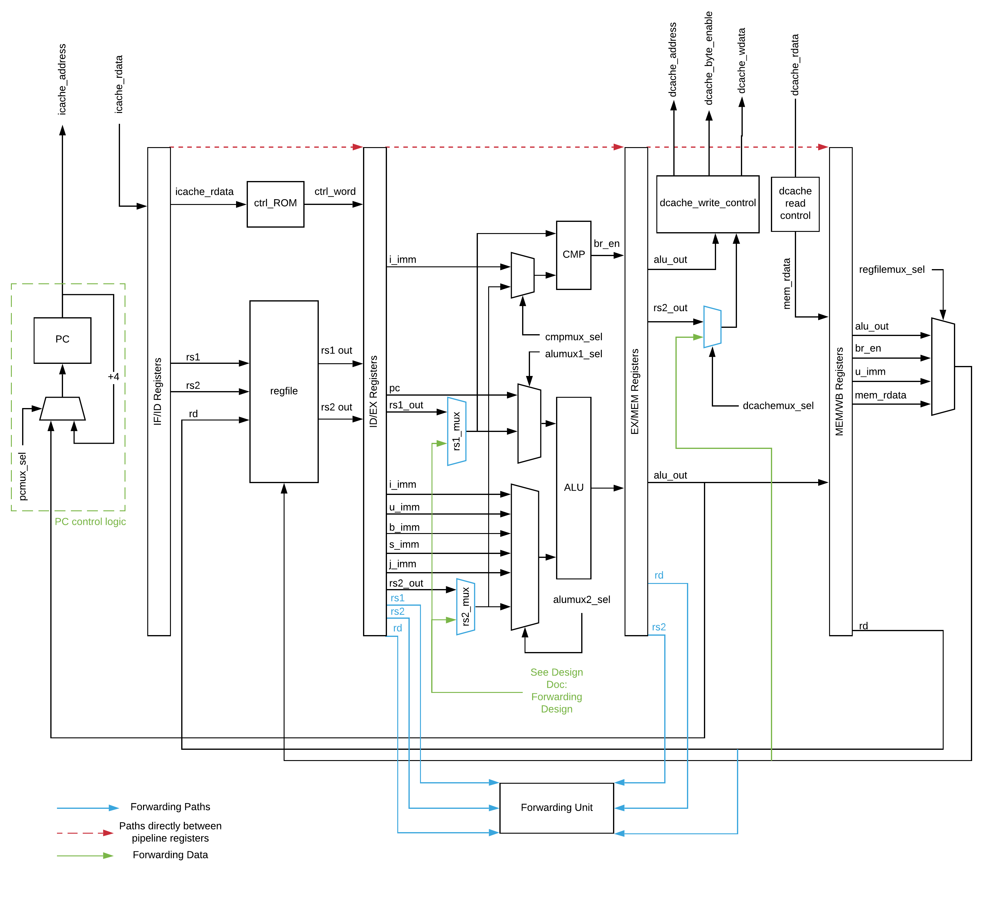
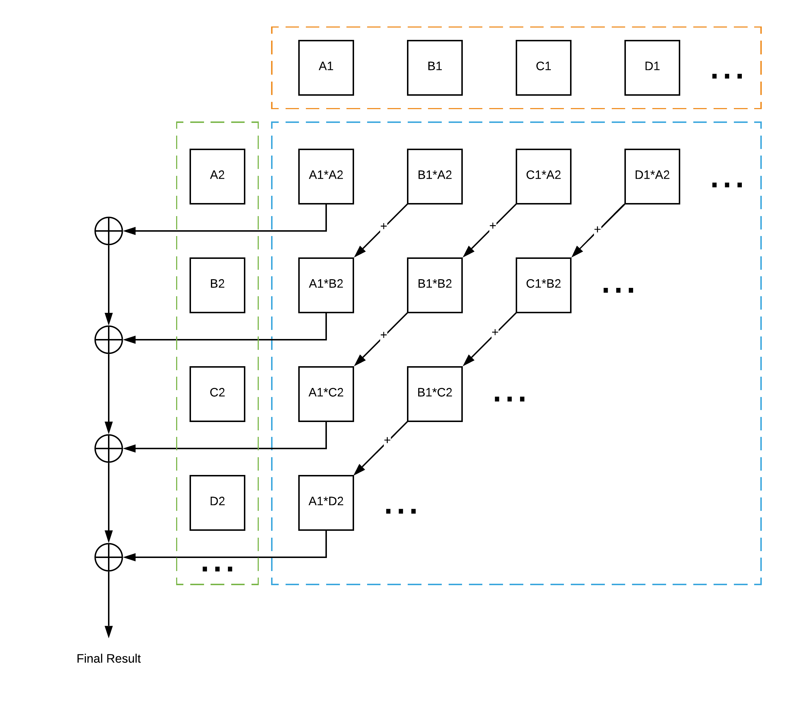
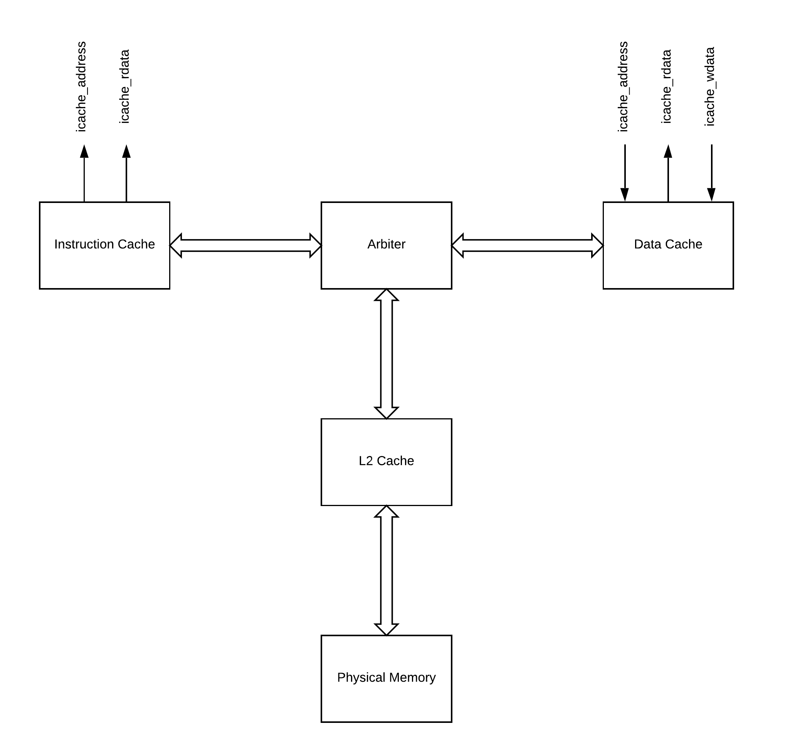

# RISC V Pipelined Processor

## Introduction

The goal of this project was to implement a 5-stage pipelined RISC-V processor that implements both the RV32I base instruction set and the M-ext (multiplication and division) instruction set expansion. The memory is broken up into two levels: 2 x L1 caches (1 data cache and 1 instruction cache and an associated L1 cache arbiter) and a larger-but-slower L2 cache.

This project was completed as needed to fulfill the requirements of ECE 411 at the University of Illinois at Urbana-Champaign (UIUC). Being an upper-level hardware design course, this project involved not only advanced design and implementation, but also verification of our design. This project was done in a group of 3 during the COVID-19 pandemic which presented additional challenges, the primary challenge being that all work had to be done remotely.

All things considered, this project was a fun, challenging endeavor which was definitely a great send-off to my college career.

## Datapath

As visible from the diagram above, the datapath is broken up into 5 distinct pipelined stages. Due to the inherent hazards of pipelining, there is extra logic required to handle dangers such as data hazards, control hazards, etc., which is solved by the forwarding unit re-directing data into previous stages. For more information explaining the datapath, please see the design document at the root of the git project.

### Multiplier and Divider

The multiplier is a large design unit responsible for handling the M-extension, performing multiplication, division, and remainder calculation. As far as the datapath is concerned, the multiplier and divider is considered to be a part of the ALU. The multiplier acts as a modified "lattice multiplier", breaking up the inputs into chunks of 4 bits each and using 8-bit precomputed results to speed up the computation. Because this still results in extra long combinational paths, it was necessary to break up the multiplier into it's own pipelined stages that the entire datapath has to wait on.

The divider unit performs both division and remainder calculations, in a very simple operation. Much like a shift-add multiplier, the divider unit operates on a shift-subtract algorithm which is highly analogous. This produces both a quotient and remainder in one fell swoop.

In order to handle signed operations, all operands are first converted to unsigned, the unsigned operation is performed, the sign of the output is computed, and then the quotient is converted into the correct sign.

## Memory Hierarchy

The memory hierarchy is self-explanatory, with a 2 level cache, and a split L1 cache between an instruction cache (icache) and data cache (dcache). An arbiter unit is responsible for handling conflicts between the L1 caches and routing data to the correct cache. See the design specification for further information.
